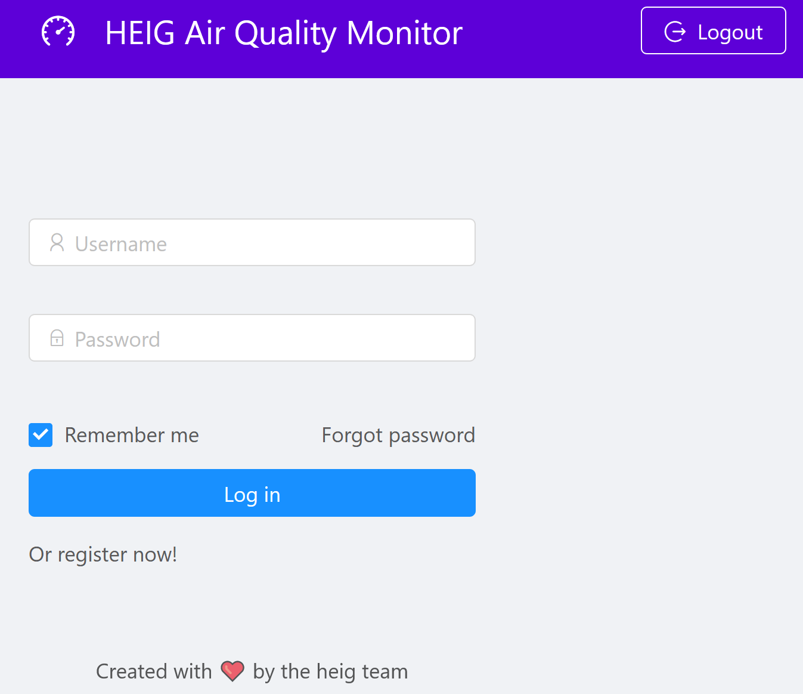
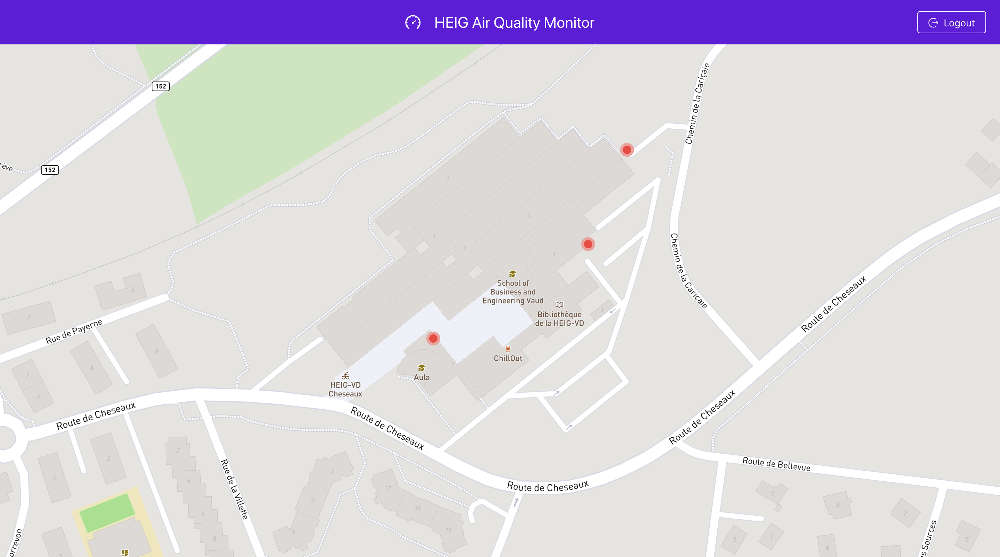
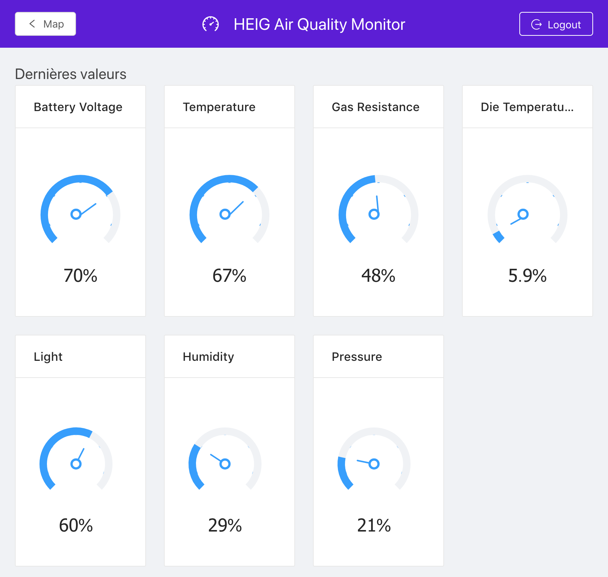
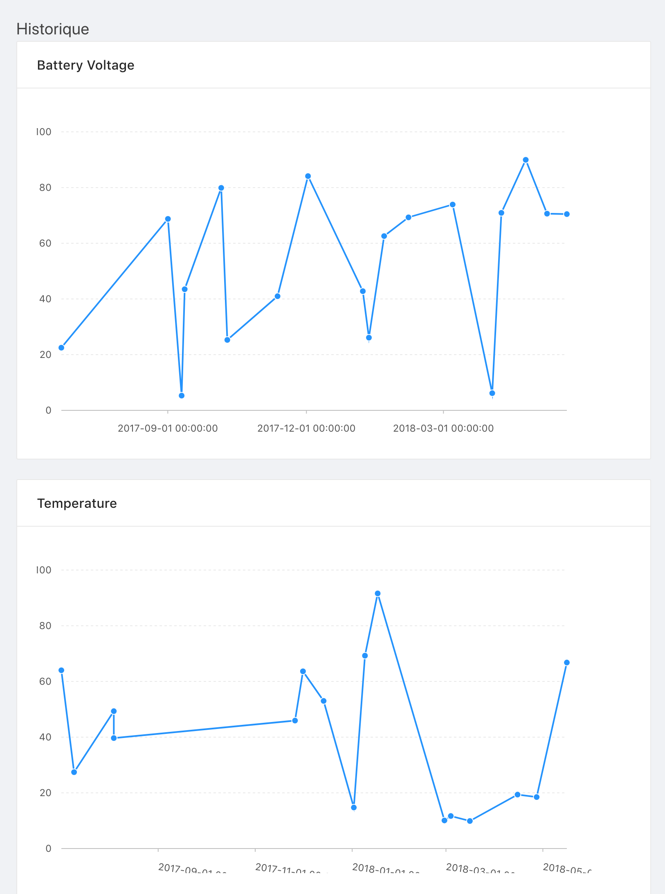
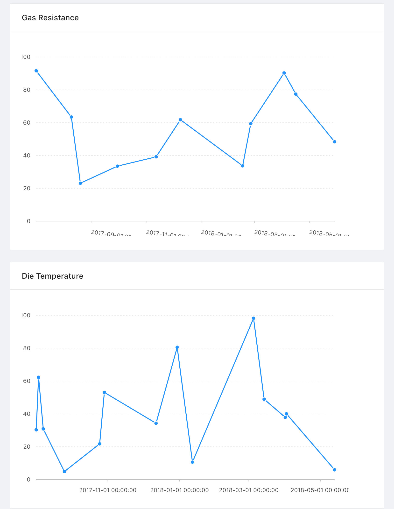
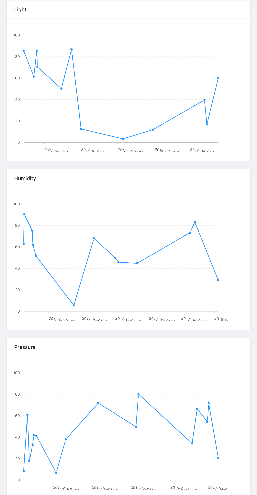

# Internet of Things - Groupe front-end

Dans le cadre du cours IOT à la HEIG-VD, Suisse.

## Introduction

Ce repository est consacré à la partie front-end. Elle consiste en la mise en place d'une interface utilisateur permettant de voir les différentes valeurs fournies par les capteurs. Les données ont été traitées de manière à présenter des informations compréhensibles et utilisables. Divers graphiques représentent donc les résultats afin de les présenter visuellement.
Une carte représente les emplacements des différents groupes de capteurs (température, humidité, particules fines,...). Un clic suffit à l'ouverture des informations liées au groupe choisi.

## Technologies utilisées

* [React](https://reactjs.org/)

 

Il s'agit d'une bibliothèque JavaScript libre développée par Facebook depuis 2013. Le but principal de cette bibliothèque est de faciliter la création d'application web monopage, via la création de composants dépendant d'un état et générant une page (ou portion) HTML à chaque changement d'état. Nous avons décidé d'utiliser cette technologie car Matthias la connait très bien. De cette manière, nous avons pu gagner énormément de temps, car React permet de créer des composants de manière rapide et propre. Lesdit composants utilisent des données entrantes qui peuvent changer au cours du temps.

* [D3](https://d3js.org/)

 

 

Il s'agit d'une bibliothèque graphique JavaScript qui permet l'affichage de données numériques sous une forme graphique et dynamique. Nous avions déjà appris à l'utiliser en cours, ce qui nous avait permis de constater son utilité. Cette bibliothèque permet en effet de créer des graphiques recherchés et facilement lisible visuellement, de manière à représenter les données sous une forme propre et utilisable. Comme de nombreux codes de graphique sont déjà mis à disposition en libre utilisation, il est facile de créer un graphique et de le modifier afin d'obtenir ce qui est nécessaire à la partie frontend.

* [Mapbox.js](https://www.mapbox.com/mapbox.js/api/)

 

Il s'agit d'une bibliothèque JavaScript — basée sur [Leaflet](https://leafletjs.com/) qui permet l'affichage de cartes interactives et dynamiques. Cette librairie est relativement bien documentée et permet de créer une carte avec différentes caractéristiques, permettant par exemple de limiter le terrain visible ou encore le zoom arrière-avant disponible.

Le projet est build avec [webpack](https://webpack.js.org/) qui aide à organiser l'application en modules

## Spécificités

### Contraintes

Le front-end doit mettre à disposition différentes fonctionnalités selon le rôle de l'utilisateur connecté.
Deux types d'utilisateurs existent: admin et lambda.
Dès que quelqu'un souhaite avoir accès à l'application, il doit se connecter avec son mot de passe.

**_admin_**

L'utilisateur admin a tous les droits. Il a donc accès à toutes les fonctionnalités de l'application.
En plus des pages que l'utilisateur lambda peut voir, il peut aussi modifier le temps de rafraichissement des capteurs.

**_lambda_**

L'utilisateur lambda a accès aux pages permettant de visionner les données et les graphiques.

### Pages

Plusieurs pages sont disponibles, chacune correspondantes à une fonctionnalité.
Une page permet de voir une carte où se trouve des points, lesquels représentent la position de chaque groupe de capteurs. Au clic de l'un de ces points, il est possible d'atteindre une page présentant les données liées aux capteurs visés.
De cette manière, il est possible d'observer séparément les capteurs selon leur emplacements.

### Endpoints

Pour plus d'informations sur les endpoints, veuillez vous référer aux documents de la partie backend.

### Visuel

Le visuel de l'application met à disposition trois pages principales, dont voici la description.

#### Login

La page de login présente un formulaire de connexion. Deux types d'utilisateurs existent : **_admin_** et **_lambda_**. Pour créer un nouvel utilisateur, il faut le faire directement depuis la base de données.
Le passage par la page de login est obligatoire. L'application n'est pas utilisable tant que l'utilisateur n'est pas connecté.

 

#### Carte

Une page présente une carte avec des points représentant les groupes de capteurs. Ces points sont sur l'emplacement réel des capteurs. Chacun de ces repères est cliquable. Cette action redirige l'utilisateur sur la page des capteurs du groupe lié au noeud choisi.

 

#### Capteurs

Chaque page des capteurs (atteignable par un clic sur un repère de la carte) présente plusieurs informations. La première partie (en haut de la page) présente les dernière valeurs relevées pour les capteurs. La partie du bas, quant à elle, présente les différents graphiques par type de données. Ces graphiques permettent d'observer les changements de valeurs sur une durée relativement longue.

 

## Déploiement
Le projet s'exécute au travers d'une image docker.

* build avec `docker build -t front-end .`
* run avec `docker run -p 80:80 -d front-end`

### en mode développement

Vous pouvez l'exécutez avec les commandes suivantes :

webpack dev => `yarn run webpack`

webpack build => `yarn run build`

## Architecture

`src` => fichiers sources du frontend

`server` => fichiers du server

`build` => config webpack

`app` => frontend buildé

## Problèmes rencontrés et difficultés à prendre en compte

* Un des problèmes principaux rencontré a été le manque de temps. En effet, le temps alloué à ce projet était relativement faible, ce qui fait que le visuel est simpliste.

## Conclusion

### Points à améliorer

Comme nous n'avons pas eu beaucoup de temps, le visuel est totalement améliorable.
Nous sommes restés relativement basiques, et nous avons fait le minimum de pages possibles. Une des améliorations possibles à ce sujet serait de mieux diviser les résultats, afin de les rendre plus lisibles.

D'autres améliorations peuvent aussi être faites:

* Possibilité de s'inscrire à l'application
* Représentation plus précise de la carte: par exemple, permettre l'utilisation de cartes personnalisées (bâtiments au lieu du monde)
* En hover sur les points, afficher les informations importantes (par exemple, les dernières valeurs des capteurs)
* Tout ce qui est configuration de visuel: choix de la date des données affichées (par exemple, du 20.02.2018 au 25.02.2018), etc.

### Points en suspens

### Améliorations futures

## Documentation supplémentaire

### Liens utiles

* React: <https://reactjs.org/>
* D3: <https://d3js.org/>
* Mapbox: <https://www.mapbox.com/mapbox.js/api/>
